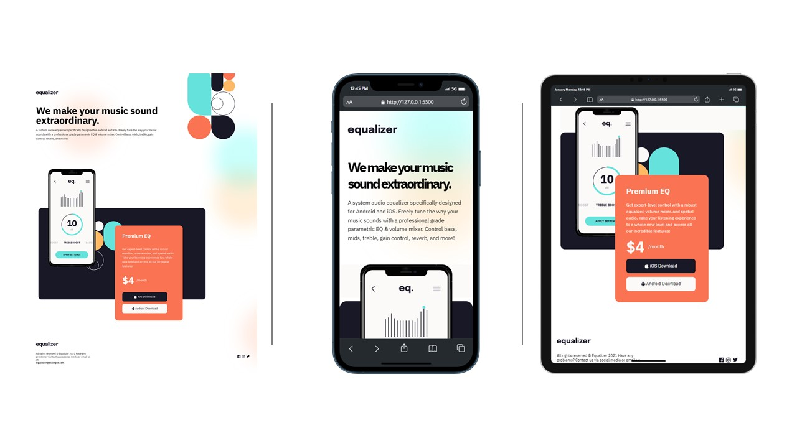

# Frontend Mentor - Equalizer landing page solution

a landing page for equalizer app for android and ios

## Table of contents

- [Overview](#overview)
  - [The challenge](#the-challenge)
  - [Screenshot](#screenshot)
  - [Links](#links)
- [My process](#my-process)
  - [Built with](#built-with)
  - [What I learned](#what-i-learned)
  - [Continued development](#continued-development)
  - [Useful resources](#useful-resources)
- [Author](#author)

## Overview

### The challenge

Users should be able to:

- View the optimal layout depending on their device's screen size
- See hover states for interactive elements
- Work with design files
- Make a full responsive landing page (mobile, tablet and desktop)
- mobile first approach

### Screenshot



### Links

- Live Site URL: [ Click to See the Site](https://equalizerlandingpageoriguy.netlify.app/)

## My process

### Built with

- Semantic HTML5 markup
- SCSS custom properties
- Flexbox
- Mobile-first workflow

### What I learned

the project was very insightful for me i've learned:

- how to adjust to different layout
- how to work with positioning
- how to work with background image, size and positions
- how to show elements only in specific screen sizes
- how to work with figma and design files
- work with layers

```scss
body {
	background-image: url(/images/bg-main-mobile.png);
	background-position: $bodyBgPositionX $bodyBgPositionY;
	background-repeat: no-repeat;
}
```

```scss
.main-top-bg {
				z-index: -2;
				position: absolute;
				.whiteBg {
					background-color: transparent;
				}
				.blackBg {
					background-color: $mainBlackColor;
					height: calc(600px - 9.8rem);
					top: 1rem;
					background-image: url(/images/svg/bg-pattern-2.svg);
					background-repeat: no-repeat;
					background-position: top;
					background-size: 258px;
				}
			}
}
```

### Continued development

I will continue to focus on:

- more organized code.
- deeper understating of background and positioning
- get use to the approach of mobile first

### Useful resources

- [https://sass-lang.com/](https://sass-lang.com/) - this site help me understand the Scss semantics
- [https://www.w3schools.com/](https://www.w3schools.com/) - this site is my defult site to aquire knowlage about html, css and javascript
- [https://developer.mozilla.org/en-US/](https://developer.mozilla.org/en-US/) - this site if amazing if i eand to take a deeper dive to understand properties bout html, css and javascript

## Author

- Website - [Ori Guy](https://github.com/origuy)
